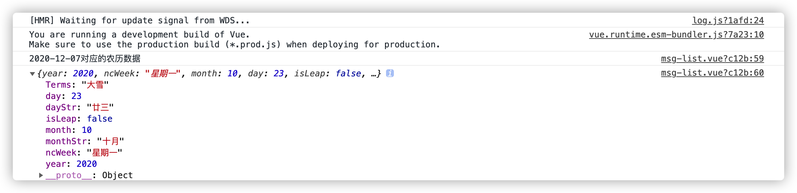

# vue-solar-lunar 支持Vue | Vue3的公历转农历插件

## 前言
本项目为一个公历转农历换的库，转换结果包含星期、是否闰月、节气，采用TypeScript编写，完美支持Vue3同时向下兼容，欢迎各位开发者使用。
## 插件安装
```bash
yarn vue-solar-lunar

# or

npm install vue-solar-lunar --save
```

## 插件使用
在需要使用的组件内，按需导入你需要的方法即可，如下所示，我们导入`solarToLunar`方法，将公历转为阴历。
```typescript
import { solarToLunar } from "vue-solar-lunarr";

console.log("2020-12-07对应的农历数据");
console.log(solarToLunar(2020, 12, 7));
```
执行结果如下：


## 更多方法
* solarToLunar 公历日期转农历日期
* getLunarLeapMonth 获取某一年的哪个农历月是闰月
* getLeapMonthDaysCount 获取某一年农历闰月的总天数
* getLunarYearDaysCount 获取某一年的农历的总天数
* getLunarYearMonthDaysCount 获取某一年某月农历的总天数
* getLunarTermDay 获取某一年某月的节气为几号
* getSolarMonthDaysCount 获取某一年某月的阳历总天数
* getSolarDayNumber 获取指定日期是阳历年中的第几天

> 具体实现以及要传的参数，请阅读与之对应的实现代码。

## 写在最后
至此，插件的所有使用方法就介绍完了。

想进一步了解插件源码的请移步项目的GitHub仓库：[vue-solar-lunar](https://github.com/likaia/vue-solar-lunar)